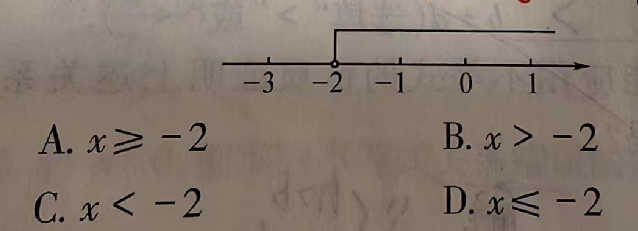
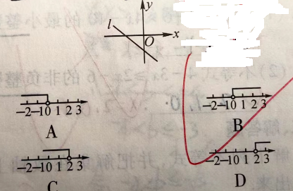
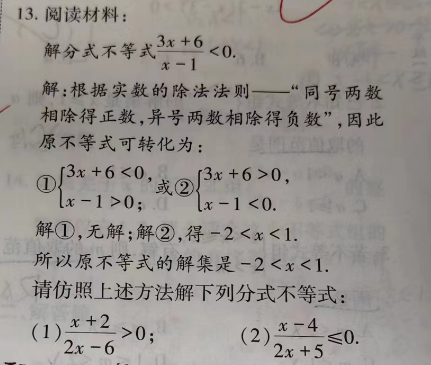

八下数据错题集
===================

1. 已知 :math:`x \geqslant y` , :math:`a < 0`, :math:`b > 0`,用不等式号连接下列各式的两边：
   :math:`abx` _____ :math:`aby`
2. 用不等式表示下列数之间的关系。

   a. a与-1之差小于 :math:`\frac{1}{2}`

   b. x的相反数与2的差不大于1

3. 已知 :math:`a < b>`, 用“>”和“<”填空

   a.  :math:`x^2a` ______  :math:`x^2b` ( :math:`{x}\neq{0}`)
4. a分别满足什么条件时下列各式成立？

    1) a > -a;
    2) :math:`a^2` > a;
    3) :math:`\frac{1}{a}` > a;
    4) :math:`|a|` > a;

不等式的解集
~~~~~~~~~~~~~~~~~~~~~
1. 下列不等式的解集中，不包括-4的是（    ）
   A.  :math:`x \leqslant -3` 
   B.  :math:`x \geqslant -4`
   C.  :math:`x \leqslant -5`
   D.  :math:`x \geqslant -6`

2. 用不等式表示如图所示的解集，正确的是（）

3. 下列说法正确的是_____(填序号)。
   
    A. 5不是y - 7 > 6的解；
    B. x = 4 是不等式x + 3 > 5的解集；
    C. 不等式x + 1 < 2有正整数解;

4. 不等式2x - 3 < 2的非负整数解有___个。
5. 在数轴上表示下列不等式的解集。

   A.  :math:`x \leqslant -5`;
   B.  :math:`-2 < -x + 3`

6. 求不等式  :math:`-2x \leqslant 6` 的解集，把它的解集表示在数轴上，并求出解集中的非正整数解。
7. 如图，直线l经过第二、三、四象极，直线l的解析式是 :math:`y = (m + 2)x + n`,则m的取值范围在数轴上表示为(  )。

8. (1)若不等式(m - 2)x > 2 - m的解集为 x < -1,则m的取值范围是___________________;

   (2)若不等式ax - 2 > 0的解集为x < -2,则关于y的方程ay + 2 = 0的解为_____;

一元一次不等式(一)
~~~~~~~~~~~~~~~~~~~~~~
1. 满足7x - 6 > 4x - 10的最小整数解是__________; 不等式 :math:`4 - 3x \geqslant 2x - 6` 的非整数解有____________;

2. 若不等式 :math:`\frac{2x - 1}{3}` -  :math:`\frac{5x + 1}{2}` :math:`\leqslant` 1
   的最小整数解是方程x = 1 +  :math:`\frac{m -3}{2}` 的解，求m的值。

3. 已知 :math:`3x + 4 \leqslant 6 + 2(x - 2)` ,则|x+1|的最小值为______;
4. (1) 已知关于x，y的方程组 :math:`\begin{cases} x - y = 3, \\  2x + y = 6a \end{cases}` 的解
   满足不等式x + y < 3,求实数a的取值范围；
   (2)已知关于x的不等式x -b > 0恰有两个负整数解，求b的取值范围;  

一元一次不等式(二)
~~~~~~~~~~~~~~~~~~~~~~
1. 小明用100元购得钢笔和笔记本共30件，已知每本笔记本2元，每支钢笔5元，那小明最多能购买钢笔___支；
2. 当正整数m为何值时，关于x的方程 :math:`\frac{5x - 3m}{4}` =  :math:`\frac{m}{2}` -  :math:`\frac{15}{4}` 的
   解时非正数？ 

一元一次不等式与一次函数（一）
~~~~~~~~~~~~~~~~~~~~~~~~~~~~~~~~
1. 已知一次函数y = -5x + 2,当x_____________时，函数y的值为非负数。

回顾与思考(一)
~~~~~~~~~~~~~~~~~~~~~~~
  :math:`\frac{2x - 1}{2}` -  :math:`\frac{5x - 1}{4}` < 0  

一元一次不等式组（一）
~~~~~~~~~~~~~~~~~~~~~~~~~~~~~~~~
1. 不等式组 :math:`\begin{cases} 3x + 10 > 0, \\  \frac{16}{3}x - 10 < 4x \end{cases}` 的最小整数解是________。 
2. 求出不等式5x - 1 > 3(x + 1), :math:`\frac{1}{2}x - 1 > 3` -  :math:`\frac{3}{2}x` , x - 1 < 3x + 1的解集的公共部分吗？ 

3.  
   .. math::
      \begin{cases}
      \frac{1 - 2x}{3} - \frac{4 - 3x}{6} \geqslant \frac{x - 2}{2},
      \\
      2x - 7 \leqslant 3(x - 1).
      \end{cases}

4. 做下面题中的第二问

一元一次不等式组（二）
~~~~~~~~~~~~~~~~~~~~~~~~~~~~~~~~
1. 已知不等式组 :math:`\begin{cases}x > a, \\  x \geqslant 1 \end{cases}` 的解集是 :math::`x \geqslant 1`，
   则a的取值范围是:

   1) a < 1         
   2)  :math:`a \leqslant 1`         
   3)  :math:`a \geqslant 1`        
   4)  a > 1
2. 若不等式组 :math:`\begin{cases} 1 < x \leqslant 2, \\ x > m  \end{cases}` 有解，则m的取值范围有： 

   1) x < 2         
   2)  :math:`m \geqslant 2`         
   3) m < 1             
   4)  :math:`1 \leqslant m < 2`
3. 若一次函数y = (2m - 1)x + 3 - 2m的图象经过第一、三、四象限，则m的取值范围是______________;
4. 求不等式 :math:`3 \leqslant5 - 2x < 9` 的整数解；
5. 已知不等式组 :math:`\begin{cases} x > -1, \\ x < 1, \\ x < 1 - k. \end{cases}`  
   
   1) 当k= :math:`\frac{1}{2}` 时，其解集为_______________;
   2) 当k=3时，其解集为__________________;
   3) 当k=-2时，其解集为___________________;
   4) 有上可知，不等式组的解集随k值的变化而变化，请仔细考虑后，写出k为任意实数时的不等式组的解集。

6. 如果关于x的不等式组 :math:`\begin{cases} 3x - a \geqslant 0, \\ 2x - b \leqslant 0  \end{cases}` 的整数解
   仅有1，2，那么适合这个不等式组的整数解a,b组成的有序数对(a, b)共有____个。

第二章回顾和思考(二)
~~~~~~~~~~~~~~~~~~~~~~~~~~
1. 若x + 5 > 0,则(    )

   A. x+1 < 0
   B. x-1 < 0
   C.  :math:`\frac{x}{5} < -1`
   D. -2x < 12

2. 江南农场收割小麦，已知1台大型收割机和3台小型收割机1小时可以收割小麦1.4公顷，2台大型收割机和5台小型收割机
1小时可以收割小麦2.5公顷。

   1) 每台大型收割机和每台小型收割机1小时收割小麦各多少公顷？
   
   2) 大型收割机每小时的费用为300元，小型收割机每小时的费用为200元，两种型号的收割机一共有10台，要求不超过2小时
   完成8公顷小麦的收割任务，且总费用不超过5400元，有几种方案？请指出费用最低的一种方案，并求出相应的费用。 

图形的平移和旋转 
--------------------------
图形平移(一)
~~~~~~~~~~~~~~~~~~~~

