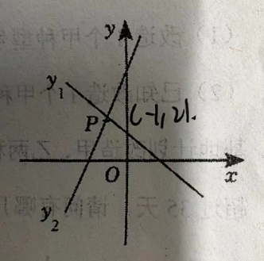

八下期末错题
===================

1. 若不等式组 :math:`\begin{cases} x - m > 0 \\ x - m < 1 \end{cases}` 的解集中每一个x值均不在 :math:`2 \leqslant x \leqslant 5` 
的范围内，则m的取值范围是:_______________。 

2. 若正整数a满足关于x的分式方程 :math:`3 - \frac{x + 2}{x - 1}=\frac{a}{1 - x}` 的解为非负数，则符合条件的所有正整数a的和为_____。 

3. 若关于y的不等式 :math:`\begin{cases} 2y + 5 \leqslant 3(y + t) \\ \frac{y - t}{2} < \frac{y}{3} - \frac{7}{6} \end{cases}` 的
整数解是-3、-2、-1、0、1，求参数t的取值范围__________________。 

<<<<<<< HEAD
4. 如图，同一平面直角坐标中，函数y1 = k1x + b与直接y2 = k2x + b2的图象交于点P(-1,2),则关于x的不等式k1(x-1)+b1 > k2(x-1)+b2的解集
为____________________。

5. 有不足30个苹果分给若干个小朋友，若每个小朋友分3个，则剩2个苹果；若每个小朋友分4个，则有一个小朋友没有分到苹果，且另外一个小朋友
分到的苹果数不足3个。已知小朋友人数是偶数，设有x个小朋友，根据题意可列不等式组为___________________________。

6. 关于x的分式方程 :math:`\frac{5}{x}=\frac{a}{x-2}` 有解，求字母a的取值范围。

7. 已知关于x的方程 :math:`\frac{x}{x-3}-2=\frac{m}{x-3}` 解为正数，求m的取值范围。

8. 若关于x的不等式组 :math:`\begin{cases} 2x-1<5x-4 \\ \frac{13}{6}x-\frac{8}{3}a \geqslant \frac{3}{2}x-2a \end{cases}` 的解集为 :math:`x \geqslant a` ，
且关于x的分式方程 :math:`\frac{x+3}{x-1} +  \frac{a}{1-x} = 2` 的解为非负数，求出所有满足条件的整数。

9. 若不等式组 :math:`\begin{cases} -2 \leqslant x \leqslant 1 \\ 3x < x+a \end{cases}` 有解，求a的取值范围。

10. 已知关于x的不等式组 :math:`\begin{cases} x-a \geqslant 0 \\ 3-2x > -1 \end{cases}` 的整数解共有5个，求a的取值范围。

11. 已知m是不等式组 :math:`\begin{cases} m-2 \leqslant 3m-1 \\ m < 8 \end{cases}` 的正整数解，则分式方
程 :math:`\frac{2}{x-2}=\frac{m}{x+1}` 有整数解的概率为多少？ 

=======
>>>>>>> 6ff66cf (Ìύ´íÌ⼯)

