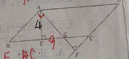

四边形
=========================

平行四边形的性质
------------------------

平行四边形定义：____________________________________
平行四边形的性质：

1. 边:____________________________________  

2. 角：______________________________________  

3. 对角线:____________________________________  

4. 对称线:______________________________________  

5. 两条平行线的距离:___________________________________________  

平行四边形的判定
-----------------------

1. ———————————————————————————————的四边形是平行四边形
2. ———————————————————————————————的四边形是平行四边形
3. ———————————————————————————————的四边形是平行四边形
4. ———————————————————————————————的四边形是平行四边形

多边形
-----------------------

1. 多边形的内角和定理： n边形的内角和等于___________________。
2. 多边形的外角和定理：任意多边形的外角和等于___________________。

试题
-----------------------

1. 如图，4x4方格纸中小正方形的边长是1，A、B两点在格点上，要在图中格点上找到点C，使得 :math:`\triangle ABC` 的面积为2，
满足条件的点C有（）

.. image:: _static/polygon.1.png
   :alt: polygon
   :width: 200
   :align: center

A 无数个     B  7个         C  6个       D   5个 

2. 如图，平行四边形ABCD的周长为30， :math:`AE \perp BC` 于E， :math:`AF \perp DC` 的延长线于点F， AE=4, AF=6,则平行
四边形的面积是_____________________。

3. 已知▱ABCD中，AB=8cm, BC=5cm, 过点B做 :math:`BH \perp CD` 交CD所在的直线于H,若BH=4cm,则DH=__________cm。

4. 以点O、A、B、C为顶点的平行四边形放置在平面直角坐标系 :math:`xOy` 中，其中点 :math:`O` 为坐标原点，若点C的坐标是(1,3)，点A的
坐标是(5,0),则点B的坐标是（  ）

A (6,3)或(4,-3)   B (6,3)或(-4,3)   C (6,3)或(-3,4)或(3,-4)    D (6,3)或(-4,3)或(4,-3)

5. 如图：点E、F、G、H分别是线段AC、BD、BC、AD的中点，求证:四边形EGFH是平行四边形

6. 若一个多边形的内角和为 :math:`900^\circ` ，则从该多边形的一个顶点出发的对角线条数是（） 

 A.3     B.4      C.5       D.6 

7. 如图，小明从点O出发，前往5m后向右转 :math:`15^\circ` ,再前进5m后又右转 :math:`15^\circ` ，...这样一直下去，直到
他第一次回到出发点0为止，他所走的路径构成了一个多边形。
(1) 小明一共走了多少米？
(2) 这个多边形的内角和是多少度？

8. 如图是用边长相等的正多角形和正多边形各种地砖铺设的部分地面示意图，则这种正多边形地砖的边数是（   ）
 
 A.6    B. 8      C. 10     D.12

 .. image:: _static/polygon.5.png
   :alt: polygon
   :width: 200
   :align: center